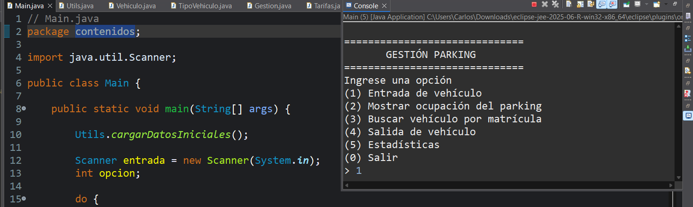
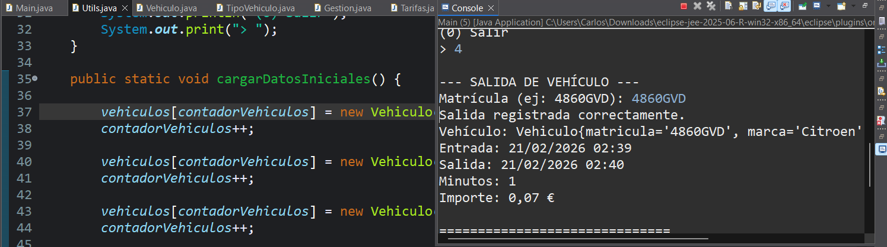

## Parking Manager — Java (OOP)

Console-based parking management system built in Java to practice Object-Oriented Programming (DAW 1st year).

### Features
- Vehicle check-in / check-out
- Entry/exit time tracking using `LocalDateTime`
- Stay cost calculation (minutes-based)
- Different rates by vehicle type
- Search by license plate
- Basic stats (occupancy, revenue, distribution)

### Concepts
- OOP (classes, encapsulation)
- Enums
- Arrays + counters
- Regex validation
- Date/Time API (`LocalDateTime`, `Duration`)

### Run
Open the project in Eclipse and run `Main.java`.

### Next improvements
- Persistence (file or database)
- Refactor to `ArrayList`
- Real parking slot availability management
- GUI / Web version

### Screenshots

